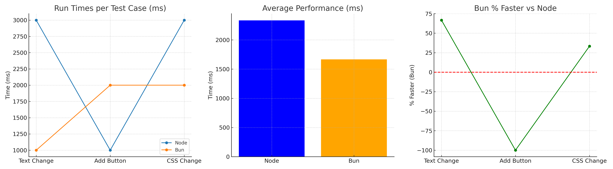
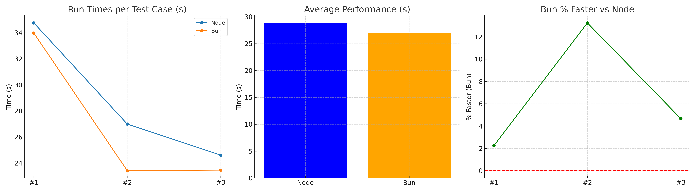
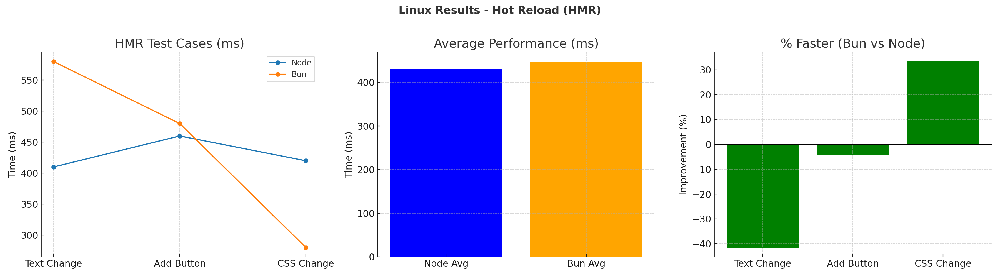
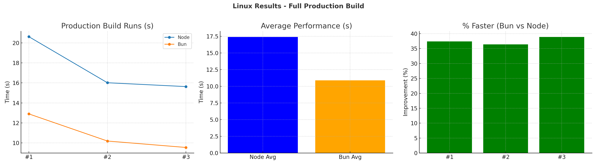

# JavaScript Runtime Performance Comparison: Node vs Bun

## 📌 Purpose
The goal of this benchmark is to compare **Node.js (npm)** and **Bun** in terms of:
- **Development performance** (Hot Module Reload speed)
- **Production build performance**

Both environments used the same React (CRA) project.  
Two versions of the project were tested:
- **Node version**: Installed using `npm install` and run with `npm start`
- **Bun version**: Installed using `bun install` and run with `bun start`


## 🧪 Test Environment
### Windows
- **OS**: Windows 10 (via Git Bash terminal in VS Code)  
- **Machine**: 
    - Lenovo ThinkPad T15 Gen 1
    - 32 GB RAM
    - Intel(R) Core(TM) i7-10510U CPU @ 1.80GHz
- **React Version**: 19.1.0
- **Node Version**: v22.18.0
- **Bun Version**: 1.2.20

### Linux
- **OS**: Linux Mint  
- **Machine**: Same as above (Lenovo ThinkPad T15 Gen 1)  
- **React, Node, Bun versions**: Same versions as Windows  


## ✅ Test Cases & Steps

### **1. Hot Reload Speed (HMR)**
**Purpose:** Measure the time it takes for changes to reflect in the browser after saving the file.

**Steps:**
1. Start both dev servers:
   ```bash
    npm start   # Node version
    bun start   # Bun version
   ```                                                             
 
2. Make the following changes in MainPage.tsx and measure "Compiled successfully" time in the console:

    - Change text inside a component:

    ```tsx
    <Typography variant="h4" gutterBottom>
        Proxmox VM Dashboard Node version
    </Typography>
    ```

    - Add a new component:

    ```tsx
    <button>Click Me</button>
    ```

    - Modify CSS styling.

    ```tsx
    <Button
        variant="contained"
        color="primary"
        onClick={handleStopVMs}
        disabled={selectedVMIds.length === 0}
        sx={{ mb: 2 }}
    >
        Stop VMs
    </Button>
    ```


3. Repeat 3 times per runtime and calculate average time.


### **2. Full Production Build**
**Purpose:**  Compare how long it takes to create a production build. 

**Steps:**
1. Clean previous builds (rm -rf build).

2. For Node version:

   ```bash
   time npm run build
   ```   
3. For Bun version:

   ```bash
   time bun run build
   ```  
4. Repeat 2-3 times and calculate average time.


## 📊 Results
### Windows Results
#### Hot Reload (HMR)
| Test Change | Node (ms) | Bun (ms) | % Faster (Bun) |
| ----------- | --------- | -------- | -------------- |
| Text Change | 3000      | 1000     | **66.7%**      |
| Add Button  | 1000      | 2000     | **-100%**      |
| CSS Change  | 3000      | 2000     | **33.3%**      |
| **Average** | **2333**  | **1667** | **28.6%**      |


#### Full Production Build
| Run         | Node (s)   | Bun (s)    | % Faster (Bun) |
| ----------- | ---------- | ---------- | -------------- |
| #1          | 34.757     | 33.978     | 2.24%          |
| #2          | 26.996     | 23.422     | 13.25%         |
| #3          | 24.612     | 23.465     | 4.66%          |
| **Average** | **28.788** | **26.955** | **6.36%**      |


### Linux Results
#### Hot Reload (HMR)
| Test Change | Node (ms) | Bun (ms)  | % Faster (Bun) |
| ----------- | --------- | --------- | -------------- |
| Text Change | 410       | 580       | **-41.5%**     |
| Add Button  | 460       | 480       | **-4.3%**      |
| CSS Change  | 420       | 280       | **33.3%**      |
| **Average** | **430.0** | **446.7** | **-3.9%**      |


#### Full Production Build
| Run         | Node (s) | Bun (s)  | % Faster (Bun) |
| ----------- | -------- | -------- | -------------- |
| #1          | 20.618   | 12.905   | **37.4%**      |
| #2          | 16.016   | 10.194   | **36.4%**      |
| #3          | 15.632   | 9.551    | **38.9%**      |
| **Average** | **17.4** | **10.9** | **37.2%**      |


## 📈 Graphs
### Windows Results
#### HMR Speed Comparison



#### Full Build Time Comparison



### Linux Results
#### HMR Speed Comparison



#### Full Build Time Comparison




### Windows vs Linux 
